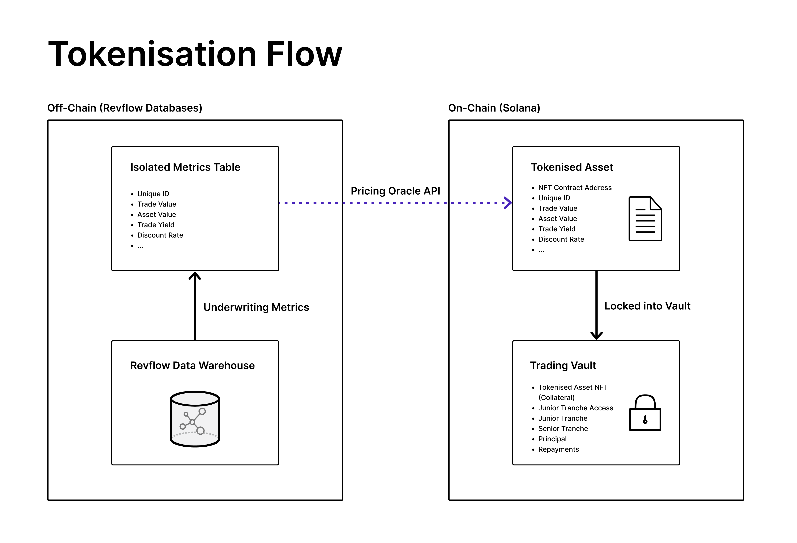

# 📂 Asset Tokenisation

To turn monthly recurring revenue into a tradable asset, the revenue must first be securitised. To do this via DeFi, the revenue must be securitised _and_ tokenised. The process of tokenisation is straight-forward; the terms of the trade are sent to the blockchain where they're converted into a Non-Fungible Token (NFT) that acts as an asset-backed security. The asset-backed security is then sent to a vault to be used as collateral to trade against. This section will look at the tokenisation process to turn future monthly recurring revenue into a tradable asset on the Solana blockchain.&#x20;

### Tokenisation Process&#x20;

1. A business has been onboarded onto the Revflow platform and they have been given a Health Score, Discount Rate and a Trading Limit.&#x20;
2. The business then selects how much capital they wish to receive upfront from their monthly recurring revenue, with the maximum being their trading limit amount.&#x20;
3. Once the business has confirmed the trade and signed the terms sheet, the details of the trade are sent to an isolated table within Revflow's data warehouse. These details encompass the following (but not limited to):
   * Unique ID
   * Asset Value (Combined Annual Contract Value)
   * Discount Rate
   * Trade Amount (CACV \* Discount Rate)
   * Trade Yield (% between Trade Amount and Asset Value)
   * Health Score
   * Start Date
   * Term
   * Maturity Date
   * Growth Rate
   * ...
4. An Oracle picks this data up and interfaces it onto the Solana Blockchain. The smart contract turns the trade terms into the NFT asset-backed security and deposits it into a new vault specifically made for the trade to take place.
5. The NFT asset-backed security acts as collateral for the investors to trade against. Once the trade is filled, the capital goes to the business and repayments are done monthly back into the Vault. At Maturity, the NFT asset-backed security is sent to a burn address and the vault becomes inaccessible.&#x20;

