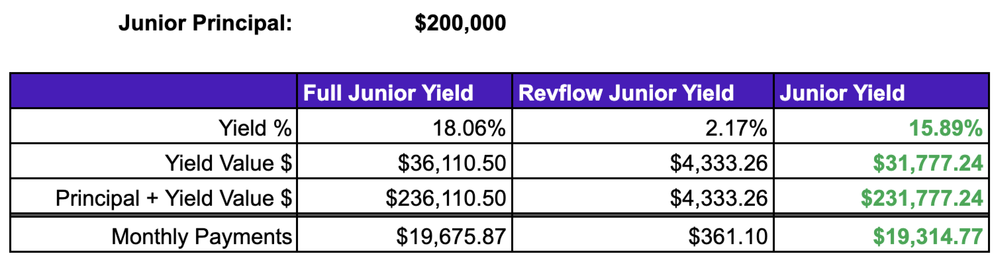

# 🌊 Example


This page contains formulas written in LaTex. For the best reading experience, please view this page on Desktop.


We'll go over an end-to-end example in this section so you can visualise the returns the Junior and Senior Tranche make in both Yield Percentage terms and Yield Amount.

_Note: This section excludes the full mechanism of the Revflow liquidity pool, and thus no reserve examples will be given. However, stay tuned, those examples of coming too!_&#x20;

## Scenario:

A business has been onboarded onto the Revflow platform. They have a trading limit of $2,500,000, which is 50% of their ACV. The business has been given a 750 Health Score, and is **requesting $1,000,000 in upfront capital.** Their calculated **Discount Rate** based on their risk levels is **9.5%.** The example below will go through the calculations for yield percentages and yield amounts for the Junior and Senior Tranches that participate in this deal.&#x20;

With a **Trade Value of $1,000,000** and a **Discount Rate of 9.5%**, we go back to the Asset Value calculation to determine how much future recurring revenue collateral the business needs to post to fund the trade.&#x20;

$$
Asset\:Value\:=\:\frac{Trade\:Value}{(1\:-\:Discount\:Rate)}
$$

$1,000,000 / (1 - 0.095) = $1,104,972.38

**Asset Value = $1,104,972.38**

With this scenario, the business will need to payback $1,104,972.38 over 12 months in return for $1,000,000 upfront capital. No debt, no dilution, no interest rates. Just a fixed-rate based upon their risk levels.&#x20;

We then need to calculate the Trade Yield, which is the yield percentage the vault will return over those 12 months.&#x20;

$$
Trade\:Yield\:=\:\frac{Asset\:Value}{Trade\:Value}\:-1
$$

($1,104,972.38 / $1,000,000) - 1 = 10.4972%

**Trade Yield = 10.4972% APY**

We now have the four key elements to begin the funding for this trade:

| Asset Value   | Trade Value | Discount Rate | Trade Yield  |
| ------------- | ----------- | ------------- | ------------ |
| $1,104,972.38 | $1,000,000  | 9.5%          | 10.4972% APY |

## Junior Tranche Returns

Before the Junior Tranche Investors fund the Junior Tranche, they will want to know their expected returns and the amount of capital they need to provide as the principal. For the principal, we start with the following calculation:

$$
Junior\:Principal\:Percentage\:=\:\frac{1}{(Leverage\:Ratio+1)}
$$

For this scenario, the Junior Tranche has a Leverage Ratio of 4:1. This means for every $1 in the Junior Tranche, there will be $4 in the Senior Tranche. Using a Leverage Ratio of 4 we can identify that the Junior Principal Percentage of the trade is:

1 / (4 + 1) = 20%

**Junior Principal Percentage = 20.00%**

We can then plug this figure into the calculation below to identify the principal required to fund the Junior Tranche of the trade, with the overall Trade Value at $1,000,000:&#x20;

$$
Junior\:Principal\:=\:Trade\:Value\:*\:Junior\:Principal\:Percentage
$$

$1,000,000 \* 20% = $200,000

**Junior Principal = $200,000**

### Full Junior Yield:&#x20;

With the Junior Principal calculated, we can begin to calculate the yields within the Junior Tranche, starting off with the Full Junior Yield, which is the entire yield the Junior Tranche will return. The key elements to this calculation are the Trade Yield, the Leverage Ratio and the Junior Fee. The Junior Fee is a premium for Junior Tranche investors for underwriting the trade and taking on the first-loss capital risk. This will be set to 18% in this scenario. To calculate the Full Junior Yield, we need to take the Trade Yield figure and plug it into the following calculation:&#x20;

$$
Full\:Junior\:Yield\:=\:Trade\:Yield\:*(1\:+\:Leverage\:Ratio\:*\:Junior\:Fee)
$$

10.4972% \* (1 + 4 \* 18%) = 18.06%

**Full Junior Yield = 18.06% APY**

We can then multiply the Junior Principle by the Full Junior Yield to see the value of the yield for the Junior Tranche of the trade:

$200,000 \* 18.06% = $36,110.50

**Full Junior Yield Value = $36,110.50**

### Revflow Junior Yield:&#x20;

The Revflow Junior Yield is the percentage fee that Revflow takes for facilitating the transaction. In this scenario, we will assume that the Revflow Junior Fee is 12%.&#x20;

$$
Revflow\:Junior\:Yield\:=\:Full\:Junior\:Yield\:*\:Revflow\:Junior\:Fee
$$

18.06% \* 12% = 2.17%

**Revflow Junior Yield = 2.17% APY**

$200,000 \* 2.17% = $4,333.26

**Revflow Junior Yield Value = $4,333.26**

### Junior Yield:

The Junior Yield is the yield that the Junior Tranche investors will return. It is a straight forward calculation by taking the Full Junior Yield and subtracting the Revflow Junior Yield:

$$
Junior\:Yield\:=\:Full\:Junior\:Yield\:-\:Revflow\:Junior\:Yield
$$

18.06% - 2.17% = 15.89%

**Junior Yield = 15.89% APY**

$200,000 \* 15.89% = $31,774.24

**Junior Yield Value = $31,774.24**

### **Junior Tranche Results**

With those calculations complete, we can now analyse the results of the Junior Tranche for this scenario:

The Junior Tranche will return $36,110.50 in Yield upon Maturity (12 Months). Revflow will take a $4,333.26 transaction fee, meaning the Junior Tranche investors will return $31,777.24 in Yield as profit. This will leave their $200,000 investment standing at $231,774.24 at Maturity.

## Senior Tranche Returns

Once the Junior Tranche of the trade has been filled, the liquidity pool automatically funds the Senior Tranche. To calculate the Senior Principal, we take the Trade Value and subtract the Junior Principal:

$1,000,000 - $200,000 = $800,000

**Senior Principal = $800,000**

### Full Senior Yield:

With the Senior Principal calculated, we can kick off the Yield calculations for the Senior Tranche, beginning with the Full Senior Yield. The Full Senior Yield takes into account the Trade Yield and the Junior Fee (the premium the Junior Tranche gets for underwriting the trade and taking first-loss capital risk):

$$
Full\:Senior\:Yield\:=\:Trade\:Yield\:*(1\:-\:Junior\:Fee)
$$

10.4972% \* (1 - 0.18%) = 8.61%

**Full Senior Yield = 8.61% APY**

With the Full Senior Yield calculated, we can multiply the Senior Principal by the Full Senior Yield to identify the Full Senior Yield Value:

$800,000 \* 8.61% = $68,861.88

**Full Senior Yield Value = $68,861.88**

### **Revflow Senior Yield:**

Similar to the Junior Tranche, Revflow takes a fee for facilitating the transaction. This is called the Revflow Senior Yield, which will be set to 20% for this scenario.&#x20;

$$
Revflow\:Senior\:Yield\:=\:Full\:Senior\:Yield\:*\:Revflow\:Senior\:Fee
$$

8.61% \* 20% = 1.72%

**Revflow Senior Yield = 1.72% APY**

$800,000 \* 1.72% = $13,772.38

**Revflow Senior Yield Value = $13,772.38**&#x20;

### **Senior Yield:**

The Senior Yield is the yield that the liquidity pool will return at Maturity. It is the same calculation as the Junior Yield, with Senior parameters used rather than Junior:&#x20;

$$
Senior\:Yield\:=\:Full\:Senior\:Yield\:-\:Revflow\:Senior\:Yield
$$

8.61% - 1.72% = 6.89%

**Senior Yield = 6.89% APY**

### Senior Tranche Results

The Senior Tranche will return $68,861.88 in Yield upon Maturity (12 Months). Revflow will take a $13,772.38 transaction fee, meaning the liquidity pool will return $55,089.50 in Yield profit at Maturity. This will leave the liquidity pool's $800,000 investment standing at $855,089.50 from investing in the Senior Tranche.

.png>)

## Reconciliations

To finalise, we can do a two-step reconciliation; the first on the Full Junior and Full Senior Yields, and the second on the Revflow Junior/Junior Yields and Revflow Senior/Senior Yields.&#x20;

#### Full Yield Reconciliation:

As we can see, the total of the Principal and Yield Value $ is equal to the Asset Value; which is the value upon Maturity and is also the value of the future recurring revenue collateral that the business posts to obtain the Trade Value of $1,000,000.

#### Yield Reconciliation w/Revflow Fees:

Again, the total of the Principal and Yield Value $ is equal to the Asset Value.

## Closing Statement

The scenario example above showcases how we calculate tranche returns for the trades undertaken on the platform. Key highlights are:&#x20;

**Trade Value:** $1,000,000

**Asset Value:** $1,104,792.38

**Junior Principal: **<mark style="color:purple;">**$200,000**</mark>

**Junior Yield: **<mark style="color:purple;">**15.89% APY**</mark>

**Junior Yield Value: **<mark style="color:purple;">**$31,777.24**</mark>

**Junior Maturity Value: **<mark style="color:purple;">**$231,777.24**</mark>

**Senior Principal: **<mark style="color:purple;">****</mark>** **<mark style="color:green;">**$800,000**</mark>

**Senior Yield: **<mark style="color:green;">**6.89% APY**</mark>

**Senior Yield Value: **<mark style="color:green;">**$55,089.50**</mark>

**Senior Maturity Value: **<mark style="color:green;">**$855,089.50**</mark>

**Revflow Fees:** $18,105.64&#x20;

We'll be adding to the examples page in the future with additional examples showcasing Liquidity Pool returns across multiple trades (monte-carlo simulations), LP + Reserve simulations and a sneak peak at Revflow's tokenomics incentivisation programme.

****
